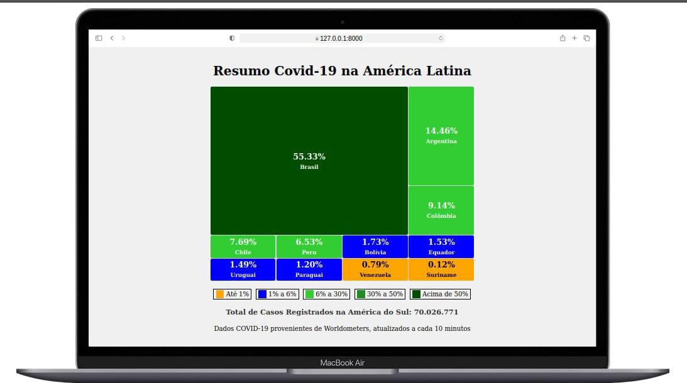
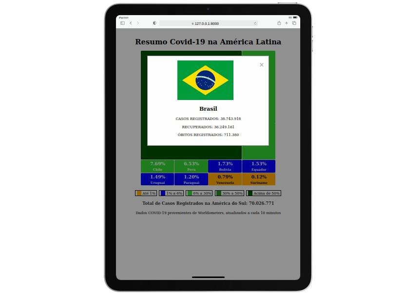

# Sistema de Resumo de COVID-19 na América do Sul

## Descrição do Projeto

Este projeto foi desenvolvido para apresentar um resumo dos casos de COVID-19 nos países da América do Sul, utilizando dados da API [disease.sh](https://disease.sh/). O sistema foi projetado com foco na escalabilidade e na organização do código, separando bem as responsabilidades.

## Funcionalidades

- Consumo da API da disease.sh para obter dados de COVID-19.
- Organização e cálculo dos dados para cada país da América do Sul.
- Apresentação dos dados em um formato visual de TreeMap utilizando HTML, CSS e JavaScript.
- Modal que exibe informações detalhadas ao clicar em um país específico.

### Características do TreeMap

- **Layout Dinâmico:** A estrutura do TreeMap se ajusta conforme a porcentagem de casos de cada país.
- **Interatividade:** Ao clicar em um país, um modal aparece com informações detalhadas sobre os casos, recuperados e mortes.

## Como Executar o Projeto

1. Clone o repositório para a sua máquina local.
2. Instale as dependências do Laravel utilizando `composer install`.
3. Configure as variáveis de ambiente no arquivo `.env`, incluindo a URL da API `URL_API`.
4. Execute as migrations e seeders para preparar o banco de dados.
5. Inicie o servidor de desenvolvimento com `php artisan serve`.
6. Acesse o sistema através do navegador, utilizando o endereço fornecido pelo comando anterior.

